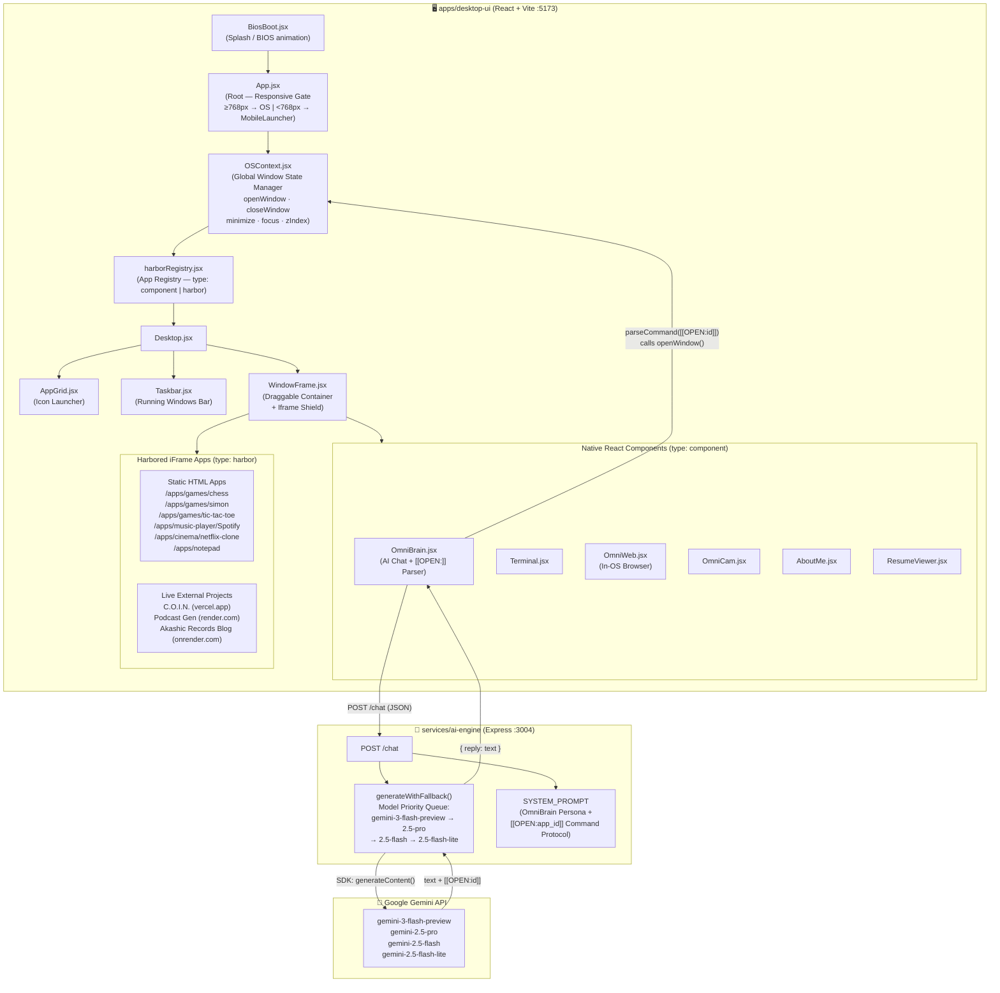
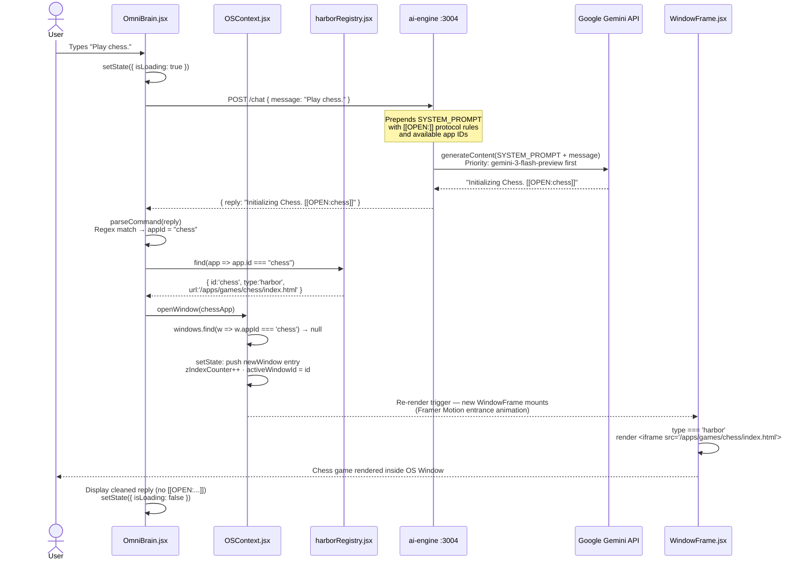

# OmniVerse — Architecture Diagrams

> **Last Updated:** June 2026 — Reflects current architecture (shop, social, and travel engines decommissioned).

---

## Diagram 1 — System Component / Architecture Diagram

---

## Diagram 2 — Sequence Diagram: OmniBrain Command → App Launch

> **Critical User Action:** User asks OmniBrain to open an app → AI Engine returns a `[[OPEN:chess]]` command → client parses it → `WindowFrame` mounts the Chess app.

---

## Architectural Bottleneck Analysis

### ⚠️ Bottleneck 1 — AI Engine: Stateless, Amnesiac Chat History

**What the interviewer will say:**
> *"Your `generateWithFallback()` reinitializes `history` on every POST request. OmniBrain has zero memory — it can't recall previous conversation turns."*

**Your defense:**
This is a deliberate trade-off for **stateless horizontal scalability**. Since each request is self-contained, the AI Engine can run as N identical instances behind a load balancer with zero session-stickiness — architecturally superior for a demo. The production fix is clean: on the first request, the server generates a `sessionId` UUID returned to the client. On subsequent requests, the client sends it back as a header. The server uses this as a **Redis key** (TTL-keyed, ~30 min) to store and retrieve the conversation history array. OmniBrain's primary role is **command dispatch** — single-turn context is sufficient for V1, making this deferred debt, not an oversight.

---

### ⚠️ Bottleneck 2 — harborRegistry: JSX Module-Level Instantiation

**What the interviewer will say:**
> *"You're instantiating `component: <OmniBrain />` at module load time. Every window shares the same singleton component instance — any internal state is shared across all open windows of the same app."*

**Your defense:**
Acknowledged. The correct pattern is to store a component reference without JSX: `component: OmniBrain` (no angle brackets), and have `WindowFrame` instantiate it as `<app.component />`. This ensures each window receives a fresh, isolated component instance. The current implementation works for the portfolio because each native app is only opened once, but the fix is a one-character change per registry entry and is the production-correct approach.

---

### ⚠️ Bottleneck 3 — OSContext: iFrame Harbor Security Model

**What the interviewer will say:**
> *"You're embedding third-party URLs — `vercel.app`, `render.com` — in raw iframes. A malicious harbored app could attempt top-frame navigation or script injection."*

**Your defense:**
Acknowledged — this is a known, accepted risk in the portfolio/demo context. The mitigations are well-defined and partially implemented: `sandbox="allow-scripts allow-same-origin allow-forms"` on each `<iframe>` prevents top-frame navigation and popup spawning. A **Content Security Policy (CSP)** header on the Vite server (`frame-ancestors 'self'`) and `X-Frame-Options: SAMEORIGIN` on harbored services complete the hardening. The **Harbor Registry pattern itself is architecturally sound** — the missing piece is the `sandbox` attribute, which is a two-line fix. The iframe shield div already exists for drag stability; it doubles as a UX safety layer preventing accidental clicks on harbor content during OS interactions.
